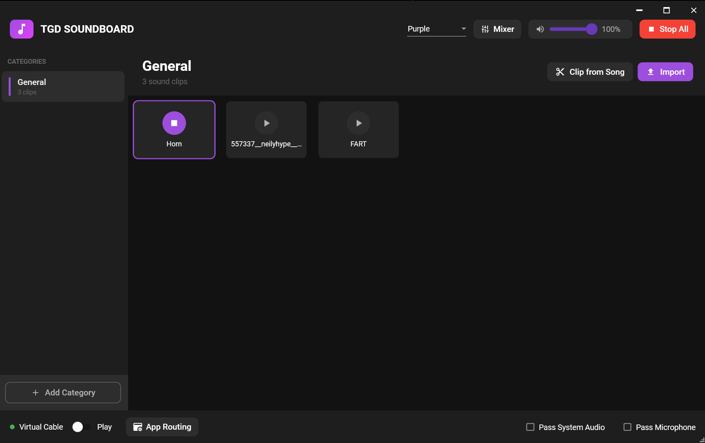

# TGD Soundboard

A modern soundboard application for streamers and content creators. Play sound clips with hotkeys, integrate with Streamlabs, and stream audio directly to OBS - no virtual audio cables required!



## Features

- **Sound Clip Playback** - Play sound clips with a single click or global hotkeys
- **Category Organization** - Group clips into customizable categories
- **Streamlabs Integration** - Save instant replays and control your stream
- **No Virtual Cables Needed** - Use Streamlabs/OBS Application Audio Capture
- **Clip Queue** - Queue up multiple clips to play in sequence
- **Clip Editor** - Import songs and trim specific sections
- **Audio Effects** - Adjust playback speed, pitch, fade in/out per clip
- **Global Hotkeys** - Trigger clips from any application
- **Multiple Themes** - Purple, Cyan, and Neon themes
- **Auto-Updates** - Automatically checks for and installs updates

## Installation

1. Download the latest installer from [Releases](https://github.com/tylergraydev/tgd-sound-board/releases)
2. Run `TgdSoundboard_Setup_2.x.x.exe`
3. Launch TGD Soundboard

## Streaming Setup

### For Streamlabs Desktop / OBS Studio

No virtual audio cables needed! Use Application Audio Capture:

1. Open **Streamlabs Desktop** (or OBS Studio 28+)
2. Click **+** to add a new source
3. Select **Application Audio Capture**
4. Choose **TGD Soundboard** from the list
5. Done! Your soundboard audio will now be captured

This method captures only the soundboard audio, keeping Discord and other apps separate.

## Usage

### Adding Sound Clips
- **Drag and drop** audio files onto the window
- Click **Import** to browse for files
- Use **Clip from Song** to trim sections from longer audio files

### Playing Clips
- **Click** a clip to play it
- **Right-click** for options (edit, delete, add to queue, set hotkey)
- Use the **master volume** slider to control overall volume

### Global Hotkeys
1. Right-click a clip
2. Select **Set Hotkey**
3. Press your desired key combination
4. The hotkey works even when the app is minimized

### Clip Queue
- Right-click a clip and select **Add to Queue**
- Click the queue icon in the header to view/manage the queue
- Clips play automatically in sequence

### Streamlabs Replay
1. Open Settings (gear icon)
2. Enter your Streamlabs API token
3. Enable auto-connect
4. Use the replay button to save instant replays

### Themes
Use the dropdown in the header to switch between:
- **Neon** - Cyberpunk style with pink/cyan gradients (default)
- **Purple** - Clean dark theme with purple accents
- **Cyan** - Modern dark theme with teal accents

## Requirements

- Windows 10 (version 2004+) or Windows 11
- .NET 8.0 Runtime (included in installer)

## Building from Source

```bash
git clone https://github.com/tylergraydev/tgd-sound-board.git
cd tgd-sound-board
dotnet build src/TgdSoundboard/TgdSoundboard.csproj
```

### Running Tests

```bash
dotnet test tests/TgdSoundboard.Tests/TgdSoundboard.Tests.csproj
```

## Tech Stack

- .NET 8 + WPF
- NAudio for audio playback
- Material Design in XAML for UI
- SQLite for data persistence
- CommunityToolkit.Mvvm for MVVM pattern

## License

MIT License
